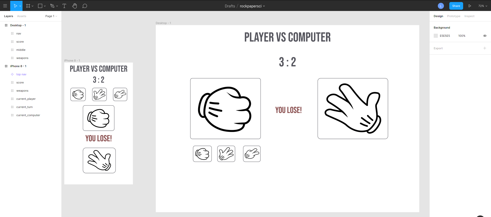
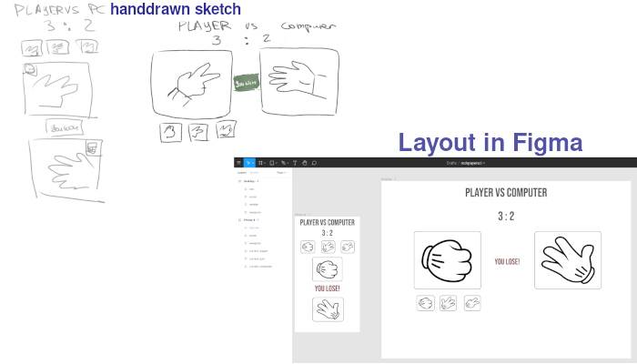

# Rock Paper Scissors
The classic game, but written in Javascript, CSS and HTML. 
At first it's going to be console.log only, then the interface will be added.

## Learning Goals:
- how to develop simple algos with JS + how to use dev tools for debugging
- DOM manipulation with Javascript
- CSS grid + beginner level responsiveness
- planning JS + HTML + CSS web apps
- basic Figma layouting skills

## To Do / Project Plan:
- [x] Basic JS algorithm with console logs
- [x] Sketch up a minimalistic layout
- [x] Make a mock-up layout + grid in Figma (learn Figma) 
  And here is the step by step layout process from handdrawn sketch to figma:
  
- [ ] structure the HTML
- [ ] Learn and apply CSS grid to the existing html structure
- [ ] Make it responsive (mobile first, media queries)
- [ ] Select nodes with JS and make the webpage dynamic
